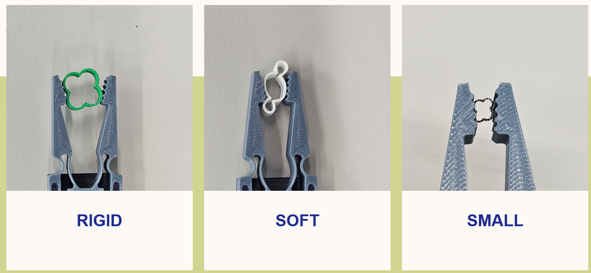
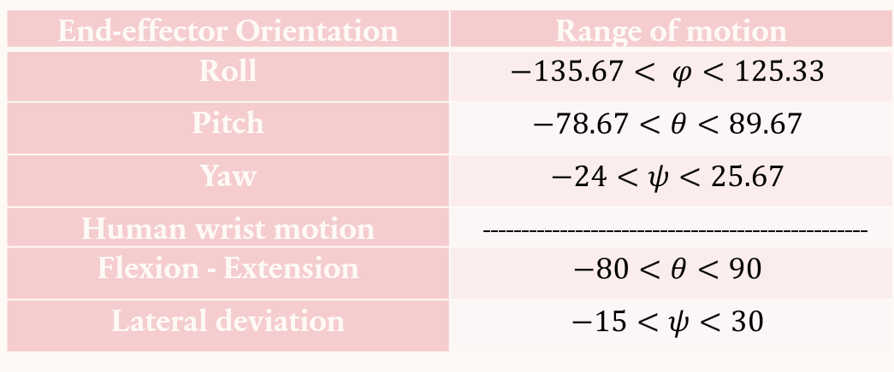

# 🧪 Experimental Testing & Results

This file documents the evaluation of the compliant gripper and wrist system, focusing on adaptability, contact force regulation, and range of motion performance.

---

## 📌 1. Gripper Adaptability Test

**Purpose:**  
To validate the gripper’s ability to passively adapt to different object shapes and sizes using compliant mechanics. An additional overload force was applied to test the contact force behavior and structural integrity.

*Figure 1: The compliant gripper grasping various objects — demonstrating shape adaptability under load.*

---

## ⚙️ 2. Constant-Force Mechanism (CFM)

The compliant mechanism includes a **constant-force mechanism**, designed to output near-constant contact force across a range of displacements — critical for safe manipulation in surgical tasks.

**Applications:**  
- Overload protection  
- Soft-tissue manipulation  
- Polishing and deburring

**Performance Range:**

- **Contact Force Output:** ≈ **3.1 N – 6.8 N**
- **Design Goal:**  
  Maintain a **nearly constant force** across a broad displacement range with **minimal variation**.

---

## 📐 3. Range of Motion (RoM) Characterization

**Purpose:**  
To visually summarize the degrees of freedom and motion ranges achieved by the integrated wrist and gripper assembly.

 
*Figure 2: Table showing the measured range of motion of the end-effector across its active degrees of freedom.*

## 📈 Future Additions

- High-speed footage of object release under load  
- Analysis of deformation zones during contact  
- Integration with haptic feedback control trials  
- Error bands for force consistency across trials

---

