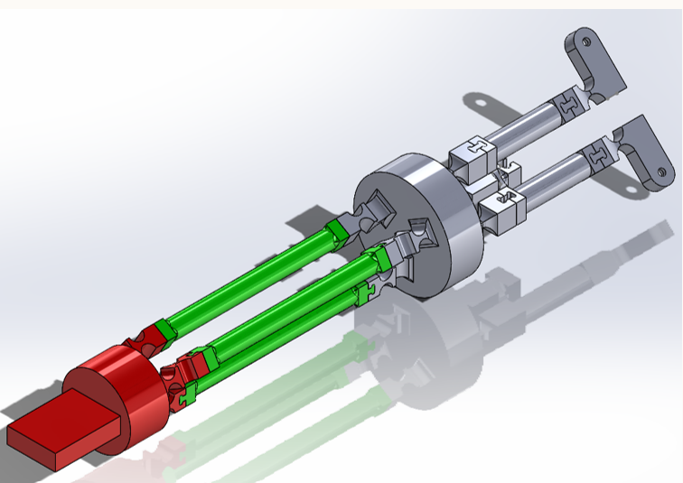

# 🛠 Hardware Overview

## 🧩 CAD System Architecture

The mechanical design consists of two integrated subsystems:

1. **Compliant Gripper End-Effector**  
2. **Parallel-Wrist Transmission System**

The entire structure is miniaturized for surgical micromanipulation, built around a **sub-millimeter diameter micro-tube** (target: ⌀ 0.6 mm), suitable for minimally invasive procedures.

The CAD implementation focuses on **monolithic**, **lightweight**, and **precision-tuned** components that allow high-fidelity manipulation with minimal control effort.

---

## ✋ Compliant Gripper

### Key Features

- **Four-Bar Linkage Mechanism**  
  - Provides repeatable, predictable motion.
  - Designed with **statically balanced compliant 'anchors'** (shown in blue).
  - Enables **energy-free motion** due to internal force balancing.

- **Adaptive Object Handling**  
  - Can grasp objects with **varying sizes and stiffness**.
  - The compliant architecture supports **gentle interaction with soft tissues**.

- **Constant Force Output**  
  - A compliant spring mechanism (shown in yellow) allows nearly **uniform output force** across a wide range of input displacements.
  - Useful for maintaining grip force **without complex sensing or active feedback**.

- **Passive Axial Stiffness**  
  - Provides a degree of **passive force sensing**, enhancing safety and tactile feedback in sensitive operations.

---

## 🤖 Parallel Wrist Transmission

### Why Parallel Kinematics?

The wrist uses a **spherical parallel platform**, offering:
- **High stiffness** and **precision**
- **Compact structure** with **reduced inertia**
- **Larger range of dexterous motion** than serial chains
- **Continuous tool rotation DOF** while maintaining control of orientation

### Motion Platform Design

- Based on a **compliant variant** of the **Agile Eye** architecture  
  (a well-known 2-DOF spherical parallel manipulator used in high-speed vision systems).
  
- Benefits include:
  - **Enlarged workspace**
  - **Straightforward inverse kinematics**
  - **Precision at speed** — ideal for camera systems and micromanipulators alike.

---

## 🔗 Transmission System: 3-PUU Slider Mechanism

- The wrist uses a **3-PUU** (Prismatic-Universal-Universal) configuration:
  - Three prismatic sliders driving compliant flexure arms
  - Flexure joints act as **miniaturized universal joints**

- **Monolithic Design Goal**  
  - Reduces part count and improves structural reliability
  - Enables **extreme miniaturization**, targeting insertion into **⌀ 0.6 mm surgical tubes**

---

## 🧠 Why Use Compliant Transmission?

Compliant transmission systems offer mechanical advantages that suit delicate surgical contexts:

| Feature | Benefit |
|--------|---------|
| **Adaptability** | Can conform to anatomical variability and object shape |
| **Safety** | Absorbs external shocks and reduces unintentional force application |
| **Energy Efficiency** | Stores elastic energy and minimizes actuation load |
| **Precision** | Enables smooth, continuous motion control |
| **Longevity** | Minimizes wear, extending the usable life of surgical components |

---

## 🧮 Conceptual Overview

**Gripper Control Logic:**

1. **Passive finger** makes first contact (self-centering).
2. **Active finger** then engages to complete grasp.
3. Grasp stability relies on **inherent compliance + friction**.

**Wrist Articulation Concept:**

- 2-DOF spherical orientation via flexure-based Agile Eye variant
- 1 DOF axial rotation from the transmission tube

---

